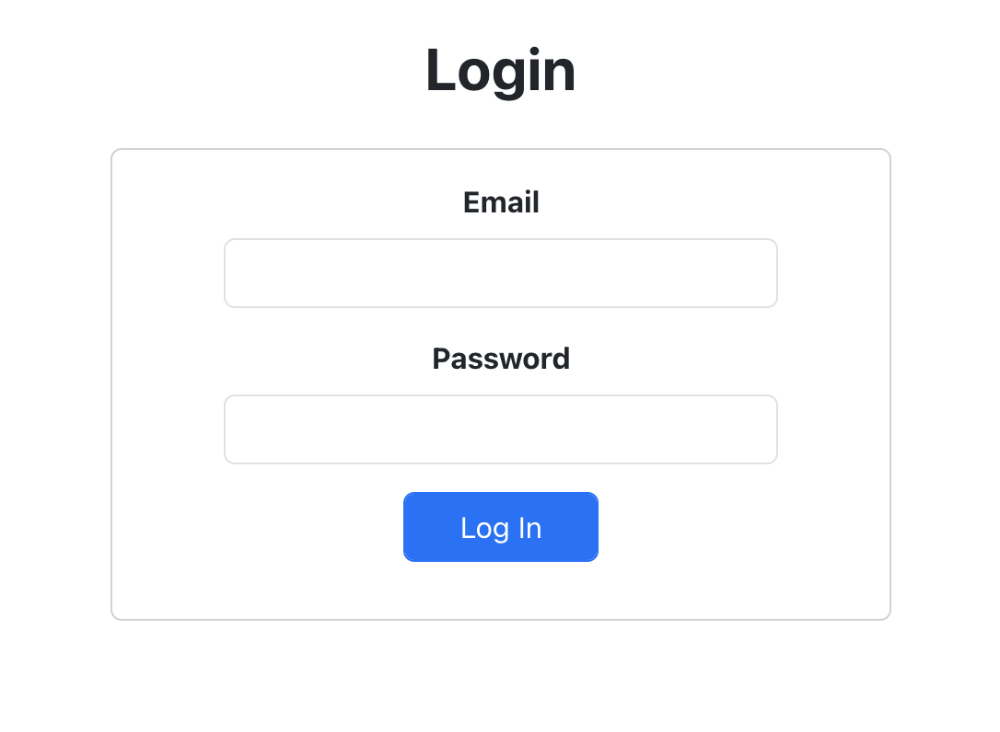
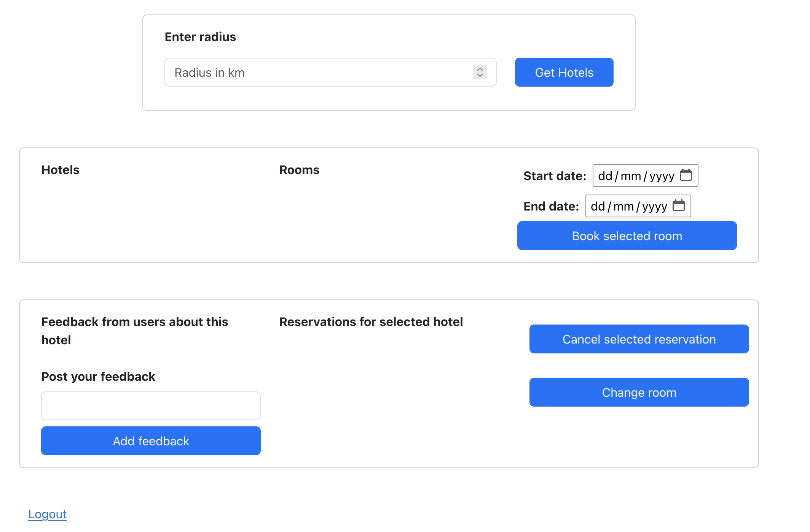
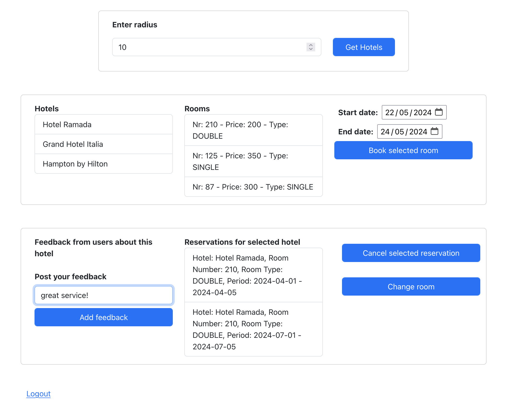

### Backend

- Java17, Spring Boot, H2 database
- The database can be accesses at: http://localhost:8080/h2-console
- JDBC URL: jdbc:h2:mem:hotels
- no Username and Password required for connection to the database
- Data about hotels and rooms is read from the hotels.json file
- Two users with credentials (email, password), and (email2, password2) are added
- User with credentials (email, password) has 2 reservations added

### Frontend
- React and Bootstrap
- Login Page
  1. Enter email
  2. Enter password
  3. Click on "Login" Button
  4. You will be redirected to the Home Page

- Home Page

- Get nearby hotels
  1. Enter numerical value for radius in "Enter Radius" input
  2. Click on "Get Hotels" button
- Get rooms for hotel
  1. Click on one of the hotels in the "Hotels" list
  2. The "Rooms" list is populated with the rooms of the hotel
- Make a reservation
  1. Click on a hotel in the "Hotels" list 
  2. Click on a room in the "Rooms" list
  3. Choose a starting date and an ending date
  4. Click on the "Book selected room" button
- Cancel a reservation
  1. Click on a reservation in the "Reservations for the selected hotel" list
  2. Click on the "Cancel selected reservation" button
- Change a room for reservation
  1. Click on a reservation in the "Reservations for the selected hotel" list
  2. Click on a room in the "Rooms" list
  3. Click on the "Change room" button
- Add feedback for hotel
  1. Add you feedback in the "Post you feedback" text input
  2. Click on the "Add feedback" button
- Logout
  1. Click on the Logout link at the bottom of the page
  2. You will be redirected to the Login Page